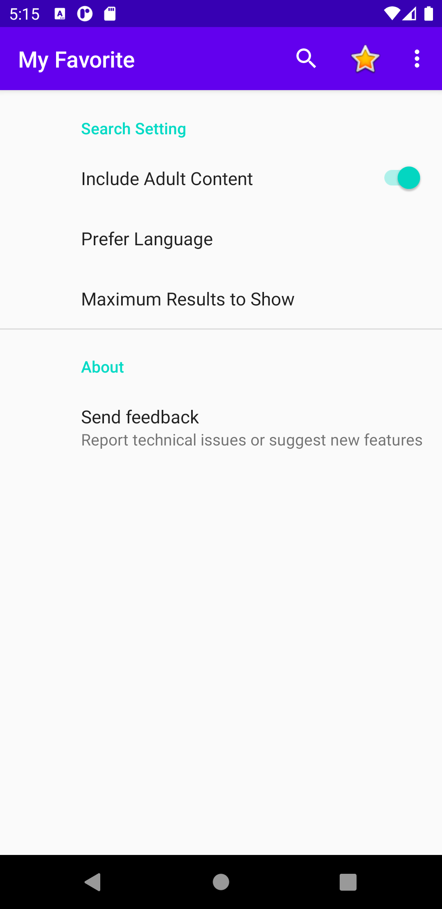
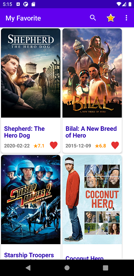
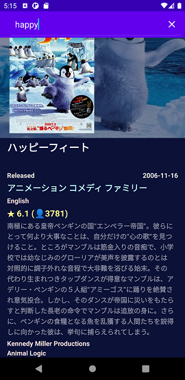
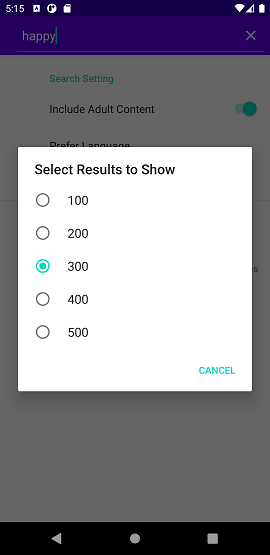
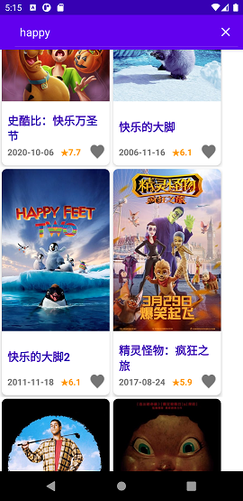
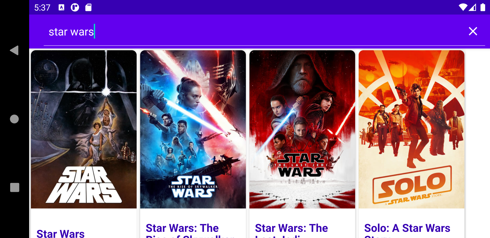

# Demo - Frontend - Eric Chan

## Background

Android Native App by 100% Kotline

Demo the use of new android develop component :
ViewPage2 and RecycleView for high performance display

Support english, japanese and chinese in search

Meet requirements of Google Play: Technical requirements checklist

(Note: This is just a technical demo, 
most commend for code and some unit-test cases are missing due to time constraint)

## App Functions

Search movie from *The Movie Database (TMDb)*

View movie's detail

Add / remove movie to user's favorite list

Multi-language support

 

## User Guide

Touch Search Icon on toolbar to make a search

Touch result movie's title to view movie's detail

Touch result "Heart" icon to add to favorite or remove it from favorite

       

## API in use

[The Movie Database API](https://developers.themoviedb.org/3)

Search Movies   
*GET /search/movie*

Movies          
*GET /movie/{movie_id}*

## Details

[App Design Spec](TMDB%20Design%20Spec.pdf)

[Documentation (Class)](Documentation-Class.pdf)

[Documentation (UI)](Documentation-UI.pdf)

With the light weight RecycleView, fragment handle by new ViewPage2, 

This app can display easily display few hundred result as a flow.

By the FlexboxLayoutManager, result can fit to different screen size and orientation.

Most control can done by swipe in one hand.

## 3rd Party Librarys

Retrofit 2.9

Fresco 2.4

Like Button 0.2

Gson 2.8.6
