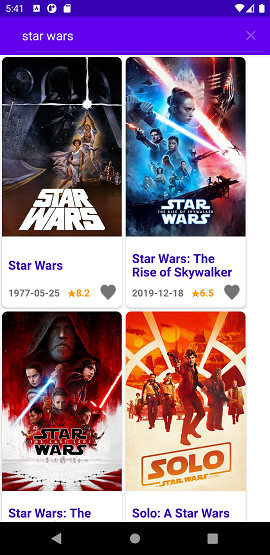

# Code challenge - Frontend

[App Design Spec](https://github.com/monstar-lab-technical-challenge/ml-mobile-test-ericchan/blob/main/TMDB%20Design%20Spec.pdf)

[Documentation (Class)](https://github.com/monstar-lab-technical-challenge/ml-mobile-test-ericchan/blob/main/Documentation-Class.pdf)

[Documentation (UI)](https://github.com/monstar-lab-technical-challenge/ml-mobile-test-ericchan/blob/main/Documentation-UI.pdf)

With the light weight RecycleView, fragment handle by new ViewPage2, 

This app can display easily display few hundred result as a flow.

By the FlexboxLayoutManager, result can fit to different screen size and orientation.

Most control can done by swipe in one hand.

Meet all requirements of Google Play Instant: Technical requirements checklist

       
